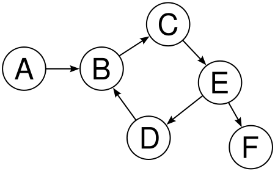

# Graphs
A graphs is a list of nodes that can be or not be connected. 
For example a Tree is a Graph.
```
     a
  /      \
n          c 
``` 
As we can see this normal tree is a Graph and there are different 
type of graphs another examples are the MinHeap or the MaxHeap 
graphs. 
Types of Graphs :  
# Directional Graph   
    
On this Directional Graphs the edges of the nodes doesn't have 
a turn back. Node A can go to Node B. But Node B can't go to
node A. 
# Undirectional Graph  
  
On Undirectional Graph the nodes can turn back as difference 
with the Directional Graph. For example Node 1 can go to Node
2 and Node 2 can go to Node 1. 
# Weighthed Graph  
  
Weighted Graph can be Directional or Undirectional but the main
difference is the edges has weigth on the edges. This weight
can be priority or other thing for node to move to the next node
For example the nodes can go first to the nodes that has minimun
weight. So 0 will move first to node 1 and node 1 will move on 
to node 2. 

# Searching on Graphs
1. DFS
2. [BFS](BFS.md)
